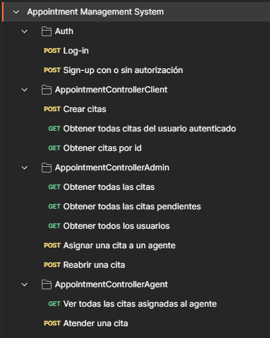

# **Appointment Management System**

**Descripción**:

El **Appointment Management System** es una aplicación diseñada para gestionar citas entre clientes, agentes y administradores. Permite a los **clientes** crear citas, a los **agentes** gestionar las citas asignadas y a los **administradores** supervisar todas las citas y usuarios del sistema. Los usuarios pueden registrarse, iniciar sesión, y realizar acciones específicas según su rol.

La aplicación está orientada a optimizar la asignación de citas y la administración de recursos, brindando un flujo eficiente para la atención y seguimiento de citas. Los administradores tienen control total sobre las citas y usuarios, mientras que los agentes pueden gestionar y atender las citas que se les asignen. Los clientes tienen acceso a sus citas personales.

<p align="center">
  
</p>

---

### **Cómo ejecutar el proyecto:**

1. **Clonar el repositorio**:
    - Clona el repositorio con el siguiente comando:

        ```bash
        git clone https://github.com/RendevMq/AppointmentProject
        ```

2. **Configurar el archivo `.env`**:
    - Renombra el archivo `.env.template` a `.env`.
    - Llena los campos necesarios en el archivo `.env`, asegurándote de tener configurados los siguientes valores:

        ```makefile
        SPRING_DATASOURCE_URL=jdbc:mysql://localhost:3306/appointmentdb
        SPRING_DATASOURCE_USERNAME=<tu-usuario-de-mysql>
        SPRING_DATASOURCE_PASSWORD=<tu-contraseña-de-mysql>
        SPRING_DATASOURCE_DB=appointmentdb
        SPRING_JWT_KEY_PRIVATE=<tu_clave_privada_jwt>
        SPRING_JWT_USER_GENERATOR=DEV_BACKEND
        ```

3. **Crear el schema en MySQL**:
    - Asegúrate de crear previamente el schema `appointmentdb` en tu servidor MySQL. Puedes hacerlo ejecutando:

        ```sql
        CREATE DATABASE appointmentdb;
        ```

4. **Configurar la clave privada JWT**:
    - Para `SPRING_JWT_KEY_PRIVATE`, utiliza una clave privada segura que será utilizada para firmar los tokens JWT. Por ejemplo, puedes generar una clave encriptada de un generador de claves en línea (como [jwt.io](https://jwt.io/)) y pegarla en el archivo `.env`. Esta clave es esencial para garantizar la seguridad en la autenticación de usuarios.
5. **Ejecutar y arrancar el proyecto**:
    - Abre el proyecto en tu IDE (como IntelliJ IDEA o VS Code).
    - Ejecuta el proyecto como una aplicación Spring Boot (usando el botón de "Run" o "Ejecutar" en tu IDE).
6. **Realizar pruebas con Postman**:
    - Una vez que el proyecto esté en ejecución, abre el archivo `appointmentAPI.postman_collection` en Postman.
    - Importa el archivo en Postman para realizar las pruebas de la API.
    - Asegúrate de realizar las peticiones con los tokens de autenticación correspondientes según el rol de usuario (Admin, Agent, Client).

---

**Características Principales**:

- **Creación de citas**: Los clientes pueden crear y gestionar sus propias citas.
- **Asignación de citas**: Los administradores pueden asignar citas a agentes.
- **Gestión de usuarios**: Los administradores pueden gestionar usuarios y roles dentro del sistema.
- **Seguridad**: Uso de autenticación con tokens para asegurar el acceso adecuado a cada recurso según el rol de usuario.
- **Flujo de trabajo por roles**: El sistema está diseñado con roles diferenciados: Cliente, Agente y Administrador, cada uno con permisos y funcionalidades específicas.
- **Pruebas de API con Postman**: Se proporciona un archivo **`appointmentAPI.postman_collection`** que contiene todos los endpoints de la API para facilitar las pruebas de funcionalidad. Este archivo puede ser importado directamente en Postman para realizar pruebas de forma sencilla.

---
### **Tecnologías Utilizadas**:

Este sistema está enfocado en brindar una solución escalable y segura para la gestión de citas, adaptándose a las necesidades de empresas que manejan citas entre múltiples usuarios.

- **Backend**: Java (Spring Boot)
- **Base de Datos**: MySQL
- **Seguridad**: Spring Security con JWT (JSON Web Tokens) para la autenticación y autorización
- **Dependencias**:
    - Spring Web
    - Spring Security
    - Spring Data JPA
    - Spring Boot DevTools
    - MySQL Connector

---

## Roles de Usuario

- **Admin**:
    - Puede gestionar todas las citas y usuarios. Tiene privilegios para asignar citas a agentes, ver todas las citas y usuarios, y realizar tareas administrativas como reabrir citas y ver citas pendientes.
- **Agent**:
    - Puede ver las citas que se le asignan y atenderlas. No tiene permisos para gestionar otros usuarios o citas de otros agentes.
- **Client**:
    - Puede crear citas para él mismo, ver las citas que ha creado, y obtener información sobre las citas asociadas a su usuario.

### **Usuarios Predeterminados**

Por defecto, se configuraron tres usuarios con diferentes roles para facilitar el uso inicial de la aplicación:

1. **Admin**
    - **Username**: admin
    - **Password**: admin
    - **Email**: admin@example.com
    - **Role**: ADMIN
2. **Agent**
    - **Username**: agent
    - **Password**: agent
    - **Email**: agent@example.com
    - **Role**: AGENT
3. **Client**
    - **Username**: client
    - **Password**: client
    - **Email**: client@example.com
    - **Role**: CLIENT
---
## Consideraciones de Seguridad

- Todos los endpoints que requieren autenticación usan un **token Bearer** que debe ser proporcionado en el encabezado de la solicitud.
- El rol de usuario debe ser asignado correctamente durante el proceso de registro. Solo un **Admin** puede asignar roles de **Agent** y **Admin** a otros usuarios.
- Los usuarios pueden acceder solo a los recursos y operaciones asociados a su rol.

---

## Endpoints

### 1. **Autenticación**

### 1.1 **Iniciar sesión (Log-in)**

- **Método**: `POST`
- **Ruta**: `/auth/log-in`
- **Cuerpo**:

```json
{
  "username": "client",
  "password": "client"
}

```

- **Descripción**: Este endpoint permite a los usuarios autenticarse en el sistema. Se requiere proporcionar un nombre de usuario y una contraseña válidos.

### 1.2 **Registrarse (Sign-up)**

- **Método**: `POST`
- **Ruta**: `/auth/sign-up`
- **Cuerpo**:

```json
{
  "username": "newuser",
  "password": "newpassword",
  "email": "newuser@example.com",
  "role": "CLIENT" 
}

```

- **Descripción**: Permite a los usuarios registrarse en el sistema. Si se especifica el rol de "ADMIN" o "AGENT", solo un usuario con rol "ADMIN" podrá realizar la operación.

---

### 2. **Citas para Cliente (AppointmentControllerClient)**

### 2.1 **Crear una cita**

- **Método**: `POST`
- **Ruta**: `/appointments/client`
- **Autenticación**: Requiere token Bearer
- **Cuerpo**:

```json
{
  "project": "Proyecto Z",
  "query": "Consulta sobre casas"
}

```

- **Descripción**: Crea una cita para el cliente autenticado. La fecha se genera automáticamente.

### 2.2 **Obtener todas las citas del usuario autenticado**

- **Método**: `GET`
- **Ruta**: `/appointments/client`
- **Autenticación**: Requiere token Bearer
- **Descripción**: Obtiene todas las citas asociadas al usuario autenticado.

### 2.3 **Obtener una cita por ID**

- **Método**: `GET`
- **Ruta**: `/appointments/client/{id}`
- **Autenticación**: Requiere token Bearer
- **Descripción**: Obtiene los detalles de una cita específica del usuario autenticado, basada en el ID de la cita.

---

### 3. **Citas para Admin (AppointmentControllerAdmin)**

### 3.1 **Obtener todas las citas**

- **Método**: `GET`
- **Ruta**: `/appointments/admin/all`
- **Autenticación**: Requiere token Bearer
- **Descripción**: Obtiene todas las citas en el sistema.

### 3.2 **Obtener todas las citas pendientes**

- **Método**: `GET`
- **Ruta**: `/appointments/admin/pending`
- **Autenticación**: Requiere token Bearer
- **Descripción**: Obtiene todas las citas que están pendientes de atención.

### 3.3 **Obtener todos los usuarios**

- **Método**: `GET`
- **Ruta**: `/appointments/admin/users`
- **Autenticación**: Requiere token Bearer
- **Descripción**: Obtiene una lista de todos los usuarios registrados en el sistema.

### 3.4 **Asignar una cita a un agente**

- **Método**: `POST`
- **Ruta**: `/appointments/admin/assign`
- **Autenticación**: Requiere token Bearer
- **Cuerpo**:

```json
{
  "appointmentId": 1,
  "agentId": 2
}

```

- **Descripción**: Asigna una cita específica a un agente. El `appointmentId` y el `agentId` son necesarios.

### 3.5 **Reabrir una cita**

- **Método**: `POST`
- **Ruta**: `/appointments/admin/reopen`
- **Autenticación**: Requiere token Bearer
- **Cuerpo**:

```json
{
  "appointmentId": 1
}

```

- **Descripción**: Permite reabrir una cita que fue previamente cerrada.

---

### 4. **Citas para Agente (AppointmentControllerAgent)**

### 4.1 **Ver todas las citas asignadas al agente**

- **Método**: `GET`
- **Ruta**: `/appointments/agent/assigned`
- **Autenticación**: Requiere token Bearer
- **Descripción**: Obtiene todas las citas que han sido asignadas al agente autenticado.

### 4.2 **Atender una cita**

- **Método**: `POST`
- **Ruta**: `/appointments/agent/{appointmentId}/attend`
- **Autenticación**: Requiere token Bearer
- **Descripción**: Permite al agente atender una cita asignada. El cuerpo de la solicitud debe contener el ID de la cita a atender.

Ejemplo de cuerpo de solicitud:

```json
{
  "appointmentId": 1
}
```

Este método permite al agente marcar una cita como atendida, actualizando su estado en el sistema.

